

<table>
    <theader>
        <tr>
            <td></td>
            <th>
                UNIVERSIDAD NACIONAL DE SAN AGUSTIN 
                FACULTAD DE INGENIERÍA DE PRODUCCIÓN Y SERVICIOS 
                DEPARTAMENTO ACADÉMICO DE INGENIERÍA DE SISTEMAS E INFORMÁTICA 
                ESCUELA PROFESIONAL DE INGENIERÍA DE SISTEMAS
            </th>
            <td></td>
        </tr>
    </theader>
    <tbody>
        <tr><td colspan="3">Formato: Guía de Práctica de Laboratorio</td></tr>
        <tr><td>Aprobación:  2022/03/01</td><td>Código: GUIA-PRLD-001</td><td>Página: 1</td></tr>
    </tbody>
</table>

GUÍA DE LABORATORIO 

<table>
<theader>
<tr><th colspan="6">INFORMACIÓN BÁSICA</th></tr>
</theader>
<tbody>
<tr><td>ASIGNATURA:</td><td colspan="5">Programación Web 2</td></tr>
<tr><td>TÍTULO DE LA PRÁCTICA:</td><td colspan="5">Ajax y NodeJS</td></tr>
<tr>
<td>NÚMERO DE PRÁCTICA:</td><td>03</td><td>AÑO LECTIVO:</td><td>2023 A</td><td>NRO. SEMESTRE:</td><td>III</td>
</tr>
<tr>
<td>FECHA DE PRESENTACION:</td><td>29/05/2023</td><td>HORA DE PRESENTACION:</td><td></td>
</tr>
<tr><td colspan="6">INTEGRANTE(S):
    <ul>
        <li>Carrasco Choque Arles Melvin</li>
        <li>Ccahuana Larota Joshep Antony</li>
        <li>Chara Condori Jean Carlo</li>
        <li>Choquecondo Aspilcueta Daniela Mabel</li>
        <li>Zapata Butron Reyser Julio</li>
    </ul>
</td>
</<tr>
<tr><td colspan="6">DOCENTE(s):
<ul>
<li>Mg. Anibal Sardon Paniagua</li>
</ul>
</td>
</<tr>
</tdbody>
</table>

# Ajax y NodeJS

## EJERCICIOS PROPUESTOS

- En grupos de 3 a 5 personas implemente una aplicación web que navegue sobre archivos Markdown y permita:

- Listas los archivos Markdown disponibles
Ver el contenido de un archivo Markdown traducido a HTML
Crear nuevos archivos MarkDown y almacenarlos en el servidor
La comunicación entre el cliente y el servidor tiene que ser usando JSON sólamente. El cliente debe usar AJAX para sus peticiones El servidor debe usar NodeJS Su aplicación debe ser de página única, es decir que sólo habrá un archivo index.html y nada más.

- Si los enlaces proporcionado en esta guía no le son suficientes, puede revisar códigos en Internet que le ayuden con cosas como ejemplos: listar un directorio en NodeJS; pero deberá incluir los enlaces correspondientes en sus archivos como comentarios y sólo podrá usar código de stackoverflow, incluir código de cualquier otra fuente está prohibido y se considerará actitud deshonesta.
    
    **- Resolucion:**
    **  index.js**
    - 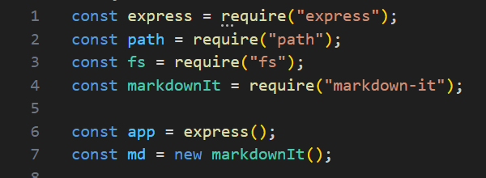
    En estas líneas se importan las dependencias necesarias, como express, path, fs (sistema de archivos) y markdown-it. Luego se crea una instancia de la aplicación Express y una instancia de markdownIt para convertir los archivos Markdown a HTML.

    - 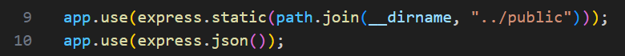
    Aquí se configuran los middleware de Express. express.static se utiliza para servir archivos estáticos desde la carpeta public, y express.json se utiliza para analizar los datos JSON de las solicitudes.

    - 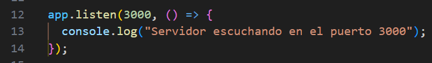
    Esta línea inicia el servidor y lo hace escuchar en el puerto 3000. Al iniciar el servidor, se muestra el mensaje "Servidor escuchando en el puerto 3000" en la consola.

    - 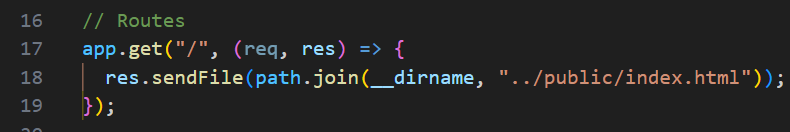
    Se define la primera ruta GET para el envío de "index.html".

    - 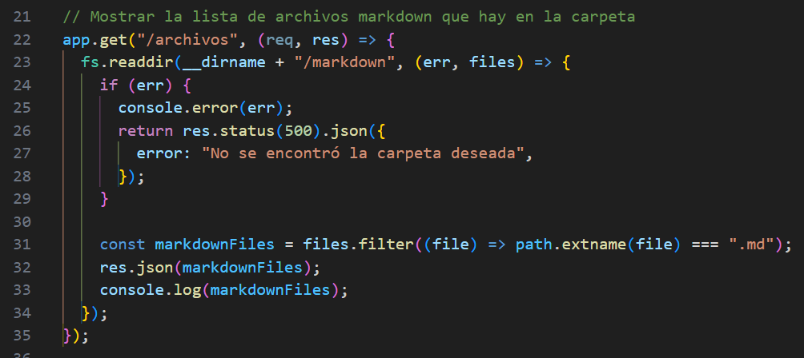
    Esta ruta devuelve la lista de archivos Markdown presentes en la carpeta /markdown. Utiliza el método readdir del módulo fs para leer el contenido de la carpeta. Luego, se filtran los archivos por extensión .md y se envía la lista en formato JSON como respuesta.
    
    - 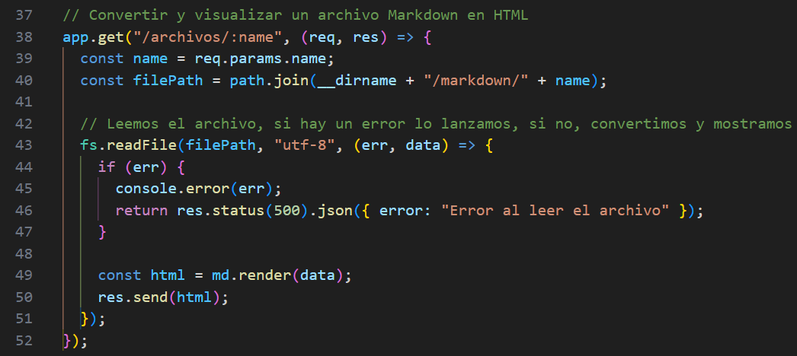
    Esta ruta se encarga de convertir un archivo Markdown en HTML y enviarlo como respuesta. El nombre del archivo se obtiene de los parámetros de la URL. Se utiliza el método readFile del módulo fs para leer el contenido del archivo. Luego, se utiliza el objeto markdownIt para convertir el contenido a HTML y se envía como respuesta.
    
    - 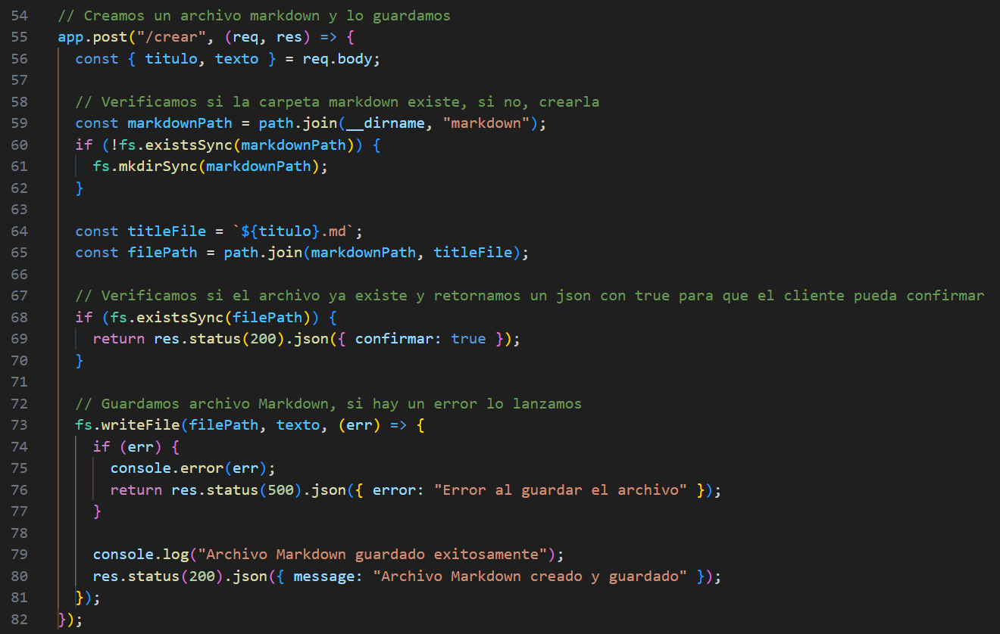
    Esta ruta maneja una solicitud POST para crear un nuevo archivo Markdown. Se obtienen los datos del título y el texto del cuerpo de la solicitud. Luego, se verifica si la carpeta /markdown existe, y si no, se crea utilizando fs.mkdirSync. A continuación, se crea la ruta del archivo con el título proporcionado. Si el archivo ya existe, se devuelve una respuesta JSON indicando que ya existe. En caso contrario, se utiliza el método writeFile de fs para guardar el archivo con el contenido proporcionado y se envía una respuesta de éxito.

    - 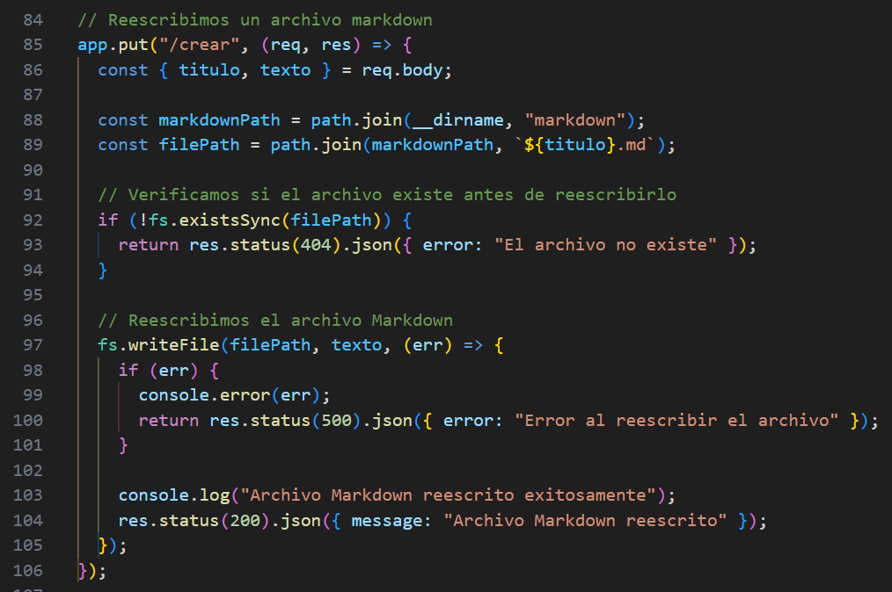
    Esta ruta maneja una solicitud PUT para reescribir un archivo Markdown existente. Se obtienen los datos del título y el texto del cuerpo de la solicitud. Luego, se construye la ruta del archivo utilizando el título. Si el archivo no existe, se devuelve una respuesta JSON con un error. En caso contrario, se utiliza el método writeFile de fs para reescribir el archivo con el nuevo contenido y se envía una respuesta de éxito.

    - 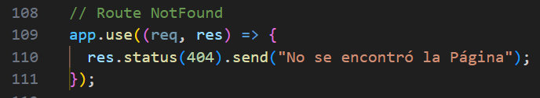
    Se devuelve una respuesta con estado 404 y el mensaje "No se encontró la Página", si no se encuentra la ruta correcta.

    **  main.js**
    - 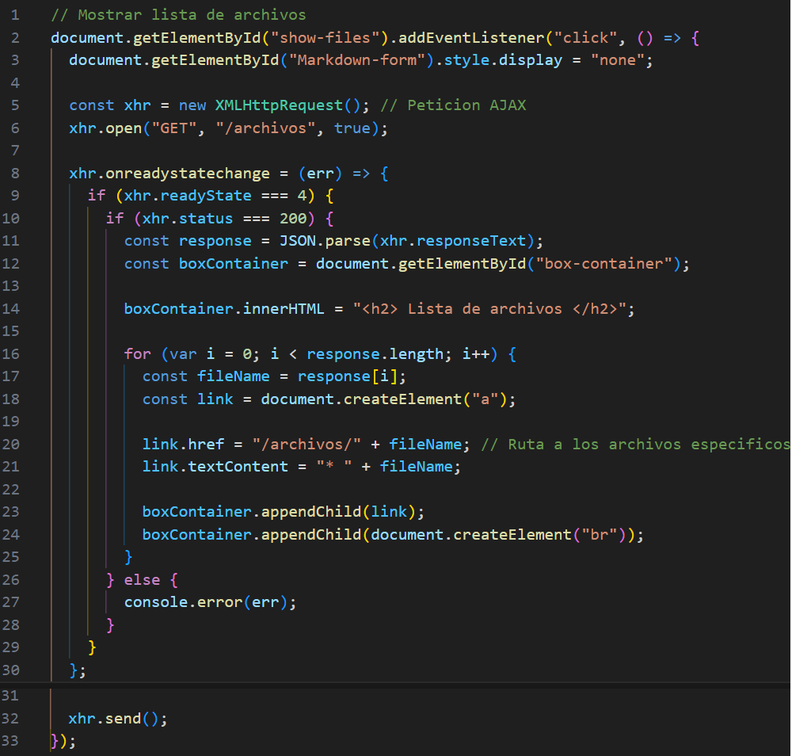
    Esta parte del código se encarga de mostrar la lista de archivos cuando se hace clic en un elemento específico. Al hacer clic en el elemento con el ID "show-files", se realiza una petición AJAX de tipo GET a la ruta "/archivos" del servidor. Una vez que se recibe la respuesta, se verifica si el estado de la respuesta es exitoso (código 200) y se obtiene el contenido de la respuesta como un objeto JavaScript mediante JSON.parse(). Luego, se obtiene el contenedor donde se mostrará la lista de archivos y se actualiza su contenido. Se crea un enlace para cada archivo en la respuesta y se le asigna la ruta hacia el archivo específico. Mostrando el nombre de cada archivo .md.

    - 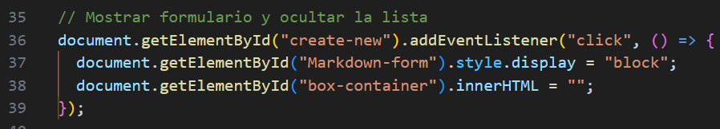
    Esta parte del código se encarga de mostrar el formulario y ocultar la lista de archivos cuando se hace clic en un elemento específico. Al hacer clic en el elemento con el ID "create-new", se muestra el formulario cambiando la propiedad de estilo display a "block", lo que lo hace visible. Además, se vacía el contenido del contenedor con ID "box-container" estableciendo su propiedad innerHTML a una cadena vacía.

    - 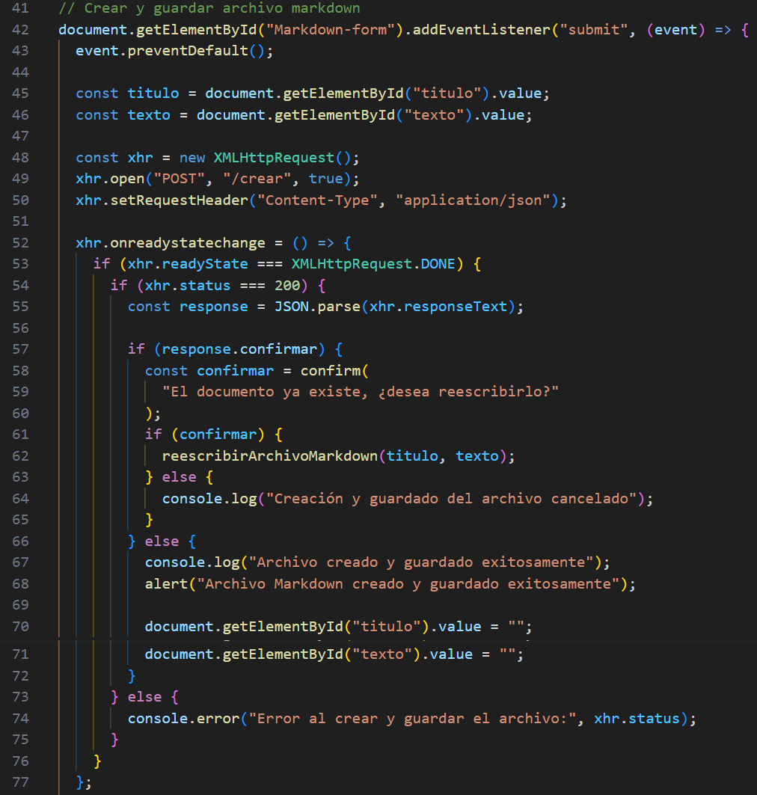
    En esta parte del código se maneja el evento de envío del formulario para crear y guardar un archivo Markdown. Al enviar el formulario, se evita el comportamiento por defecto mediante event.preventDefault(). Luego, se obtienen los valores de los campos del formulario (título y texto) usando getElementById().value. A continuación, se crea una instancia de XMLHttpRequest() para realizar una petición AJAX de tipo POST a la ruta "/crear" del servidor. Se configuran las cabeceras de la petición estableciendo el tipo de contenido como JSON mediante setRequestHeader(). Luego, se maneja el evento onreadystatechange para verificar el estado de la petición. Si el estado de la respuesta es XMLHttpRequest.DONE y el estado HTTP es exitoso (código 200), se analiza la respuesta como un objeto JSON usando JSON.parse(). Si en la respuesta se confirma que el documento ya existe, se muestra un cuadro de diálogo de confirmación al usuario. Dependiendo de la respuesta del usuario, se llama a la función reescribirArchivoMarkdown() para reescribir el archivo o se muestra un mensaje en la consola de que se canceló la creación y guardado del archivo. Si la respuesta indica que el archivo se creó y guardó exitosamente, se muestra un mensaje de alerta al usuario, se limpian los campos del formulario y se asigna un valor vacío a ellos.

    - 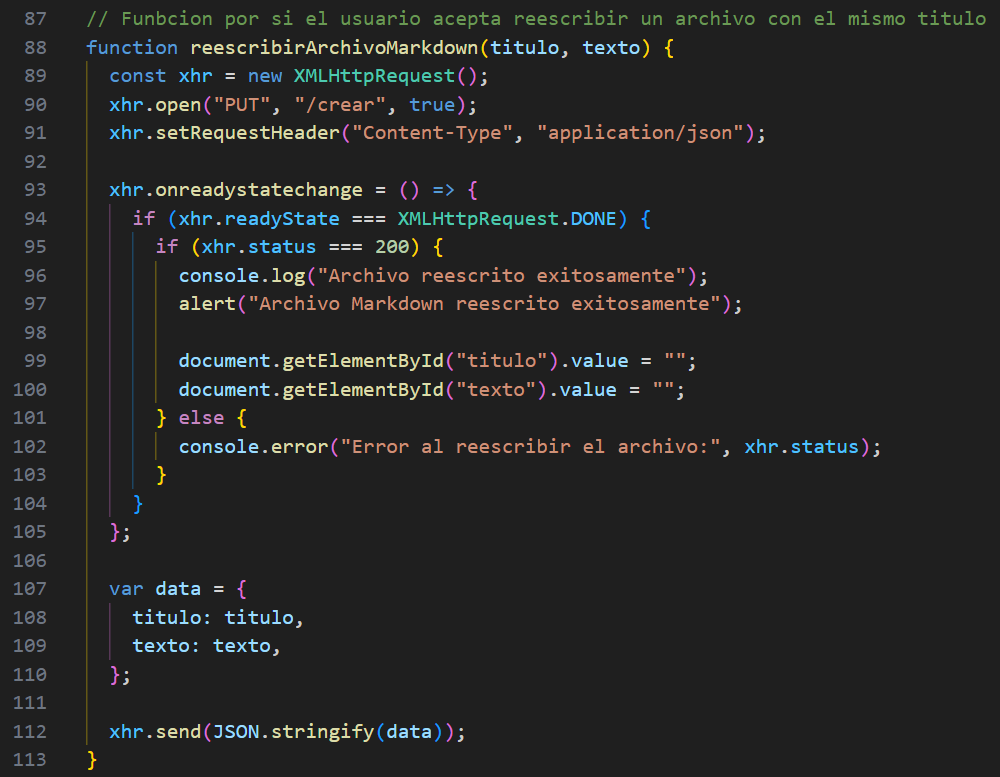
    Esta es la función reescribirArchivoMarkdown() que se llama si el usuario acepta reescribir un archivo con el mismo título. Se crea una instancia de XMLHttpRequest() para realizar una petición AJAX de tipo PUT a la ruta "/crear" del servidor. Se configuran las cabeceras de la petición estableciendo el tipo de contenido como JSON. Luego, se maneja el evento onreadystatechange para verificar el estado de la petición. Si el estado de la respuesta es XMLHttpRequest.DONE y el estado HTTP es exitoso (código 200), se muestra un mensaje en la consola y una alerta al usuario indicando que el archivo se reescribió exitosamente. También se limpian los campos del formulario asignándoles un valor vacío. Si la petición no es exitosa, se muestra un mensaje de error en la consola.
    

    **- Ejecucion:**

    - 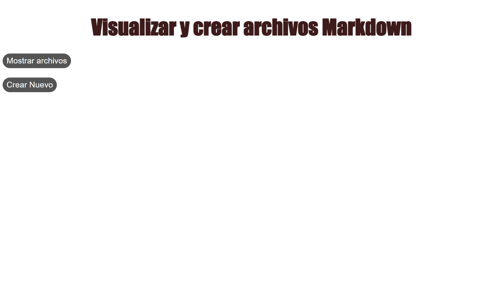
    Pagina inicial.

    - 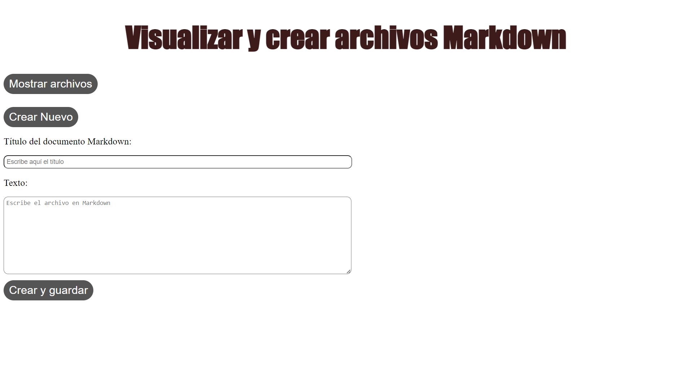
    Creación de archivos .md.

    - 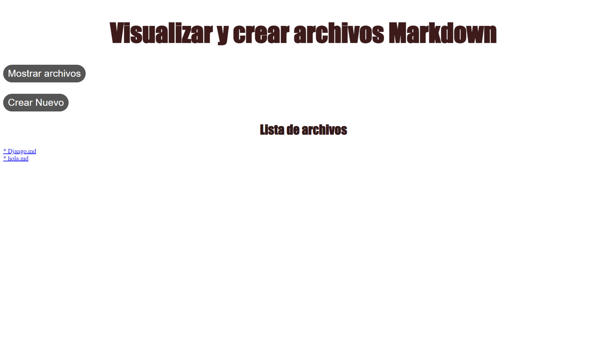
    Desplegamiento de listas de archivos .md creados y almacenados.

    - 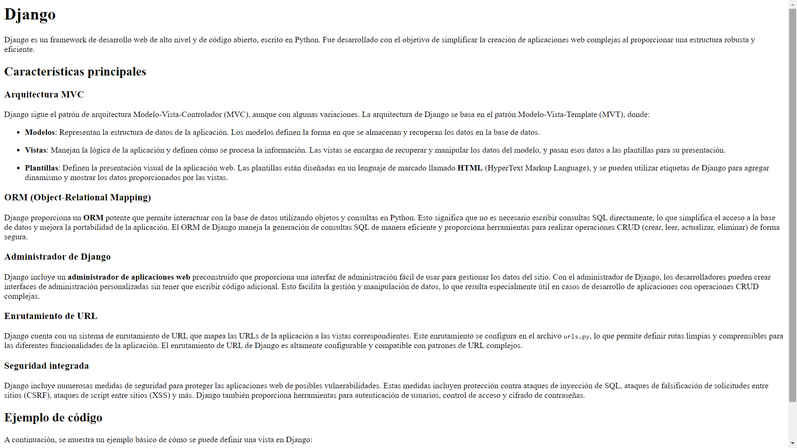
    Muestra de un archivo ya creado.

## CUESTIONARIO
- En el Ejemplo "Hola Mundo" con NodeJS. ¿Qué pasó con la línea: "Content type ….."?
    
    No se utilizó, lo que cambia el comportamiento del código por no especificar al cliente el tipo de contenido a utilizar.
    
- En los ejercicios. ¿En qué lugar debería estar el archivo poema.txt?

    Debería ubicarse en la carpeta priv.

- ¿Entiende la expresión regular en el código y se da cuenta de para qué es útil?

    Si, se especifico reemplazar los saltos de linea (\n) por el tag "< br >", el cual funciona de igual manera para html.

- Note que la respuesta del servidor está en formato JSON, ¿Habrá alguna forma de verla directamente?

    Si, algunas de ellas sería utilizando un cliente http como postman e insomnia o utilizando la consola en nuestro navegador web

**III. CONCLUSIONES**

-    Durante la realización del laboratorio, se aprendieron y aplicaron diferentes tecnologías, como NodeJS, que se utiliza en el servidor para manejar las solicitudes y respuestas. Así tambien AJAX en el lado del cliente, lo que nos permitió hacer solicitudes y actualizar la apariencia de la página sin tener que recargarla por completo.
- Por otro lado mediante la aplicación web, manipulamos archivos Markdown. Desarrollando diversas funcionalidades qu permitieron realizar acciones como listar los archivos Markdown disponibles, visualizar su contenido convertido a HTML y crear nuevos archivos Markdown para guardar en el servidor, mejorando la comprensión del formato Markdown y la habilidad de convertirlo a otros formatos, como HTML.
-  Finalmente se estableció una comunicación efectiva entre cliente y servidor utilizando JSON para intercambiar datos estructurados como listar archivos y guardar nuevos archivos en el servidor.

**RETROALIMENTACIÓN GENERAL**

**REFERENCIAS Y BIBLIOGRAFÍA**
- [https://nodejs.org/en/docs/](https://nodejs.org/en/docs/)
- [https://expressjs.com/](https://expressjs.com/)
- [https://expressjs.com/](https://expressjs.com/)
- [https://developer.mozilla.org/en-US/docs/Web/API/XMLHttpRequest](https://developer.mozilla.org/en-US/docs/Web/API/XMLHttpRequest)
- [https://daringfireball.net/projects/markdown/](https://daringfireball.net/projects/markdown/)
- [https://www.sitepoint.com/](https://www.sitepoint.com/)
#

